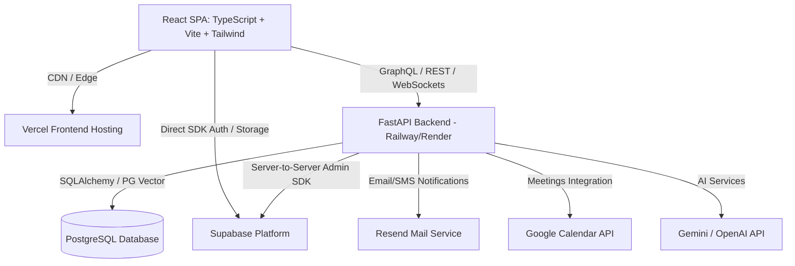
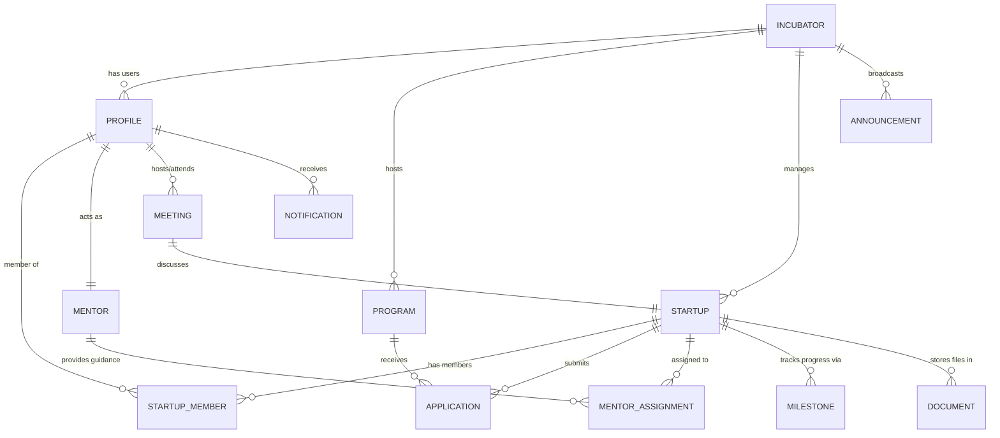

# Incubix SaaS Architectural Blueprint

This blueprint outlines the end-to-end architecture, database schema, API design, security framework, and frontend structure for **Incubix**—a production-grade, multi-tenant Startup Incubation & Innovation Platform.

---

## 1. System Architecture & High-Level Topology

Incubix is designed as a modern decoupled SaaS platform to maximize frontend performance, leverage serverless scalability, and ensure strict database integrity.



### Key Architectural Decisions:
1. **Frontend Hosting (Vercel)**: Fast global page loads using Edge caching and optimizations.
2. **Backend API (FastAPI)**: High-performance, asynchronous REST API utilizing Python Pydantic models for request validation and type safety.
3. **Database & Storage (Supabase)**: Real-time subscriptions for notifications, built-in Authentication, S3-compatible file storage, and a robust PostgreSQL database with PGVector support for future AI-powered features.
4. **Hybrid Client-Server Pattern**: 
   * **Direct Client-to-Supabase**: Used for standard CRUD operations and real-time listening (e.g., chat, notifications) secured strictly by database **Row-Level Security (RLS)**.
   * **Client-to-FastAPI**: Used for complex business logic, meeting scheduling, email generation, document processing, and AI integrations.

---

## 2. Multi-Tenant Database Schema

The database is structured to support multi-tenancy. Initially, it will follow a **Shared Database, Shared Schema** architecture, where tenant isolation is enforced at the query and database level using a `tenant_id` (or `incubator_id`) coupled with Supabase RLS.

### Entity Relationship Diagram



### Table Definitions & Specifications

#### 1. `incubators` (Tenants)
Stores configuration and branding metadata for each incubation center.
```sql
CREATE TABLE incubators (
    id UUID PRIMARY KEY DEFAULT gen_random_uuid(),
    name VARCHAR(255) NOT NULL,
    slug VARCHAR(100) UNIQUE NOT NULL, -- Used for tenant routing: subdomain.incubix.com/slug
    logo_url TEXT,
    primary_color VARCHAR(7) DEFAULT '#4F46E5', -- Theme customization
    settings JSONB DEFAULT '{}'::jsonb, -- Flexible storage for program terms, onboarding steps
    created_at TIMESTAMP WITH TIME ZONE DEFAULT timezone('utc'::text, now()) NOT NULL,
    updated_at TIMESTAMP WITH TIME ZONE DEFAULT timezone('utc'::text, now()) NOT NULL
);
CREATE INDEX idx_incubators_slug ON incubators(slug);
```

#### 2. `profiles` (Users)
Extends the Supabase built-in `auth.users` schema.
```sql
CREATE TYPE user_role AS ENUM ('super_admin', 'admin', 'founder', 'mentor', 'investor');

CREATE TABLE profiles (
    id UUID PRIMARY KEY REFERENCES auth.users(id) ON DELETE CASCADE,
    incubator_id UUID NOT NULL REFERENCES incubators(id) ON DELETE CASCADE,
    email VARCHAR(255) UNIQUE NOT NULL,
    full_name VARCHAR(255) NOT NULL,
    avatar_url TEXT,
    phone VARCHAR(20),
    role user_role NOT NULL DEFAULT 'founder',
    bio TEXT,
    skills TEXT[], -- Mainly for Mentors/Founders
    social_links JSONB DEFAULT '{}'::jsonb, -- { linkedin, twitter, website }
    created_at TIMESTAMP WITH TIME ZONE DEFAULT timezone('utc'::text, now()) NOT NULL,
    updated_at TIMESTAMP WITH TIME ZONE DEFAULT timezone('utc'::text, now()) NOT NULL
);
CREATE INDEX idx_profiles_incubator_role ON profiles(incubator_id, role);
```

#### 3. `startups`
Represents the ventures incubated on the platform.
```sql
CREATE TYPE startup_stage AS ENUM ('ideation', 'mvp', 'early_traction', 'scaling');

CREATE TABLE startups (
    id UUID PRIMARY KEY DEFAULT gen_random_uuid(),
    incubator_id UUID NOT NULL REFERENCES incubators(id) ON DELETE CASCADE,
    name VARCHAR(255) NOT NULL,
    logo_url TEXT,
    one_liner VARCHAR(255),
    description TEXT,
    industry VARCHAR(100) NOT NULL,
    stage startup_stage NOT NULL DEFAULT 'ideation',
    website TEXT,
    pitch_deck_url TEXT,
    metrics JSONB DEFAULT '{}'::jsonb, -- Revenue, headcount, funding raised
    created_at TIMESTAMP WITH TIME ZONE DEFAULT timezone('utc'::text, now()) NOT NULL,
    updated_at TIMESTAMP WITH TIME ZONE DEFAULT timezone('utc'::text, now()) NOT NULL
);
CREATE INDEX idx_startups_incubator ON startups(incubator_id);
```

#### 4. `startup_members`
Associates founders and co-founders with their respective startups.
```sql
CREATE TYPE member_title AS ENUM ('founder', 'co_founder', 'cto', 'cmo', 'employee', 'adviser');

CREATE TABLE startup_members (
    id UUID PRIMARY KEY DEFAULT gen_random_uuid(),
    startup_id UUID NOT NULL REFERENCES startups(id) ON DELETE CASCADE,
    profile_id UUID NOT NULL REFERENCES profiles(id) ON DELETE CASCADE,
    title member_title NOT NULL DEFAULT 'employee',
    joined_at TIMESTAMP WITH TIME ZONE DEFAULT timezone('utc'::text, now()) NOT NULL,
    UNIQUE(startup_id, profile_id)
);
CREATE INDEX idx_startup_members_profile ON startup_members(profile_id);
```

#### 5. `programs`
Incubation programs, acceleration cohorts, or workshops.
```sql
CREATE TYPE program_status AS ENUM ('draft', 'active', 'completed');

CREATE TABLE programs (
    id UUID PRIMARY KEY DEFAULT gen_random_uuid(),
    incubator_id UUID NOT NULL REFERENCES incubators(id) ON DELETE CASCADE,
    title VARCHAR(255) NOT NULL,
    description TEXT NOT NULL,
    start_date DATE NOT NULL,
    end_date DATE NOT NULL,
    status program_status NOT NULL DEFAULT 'draft',
    application_form_schema JSONB NOT NULL DEFAULT '[]'::jsonb, -- Custom fields for applications
    created_at TIMESTAMP WITH TIME ZONE DEFAULT timezone('utc'::text, now()) NOT NULL,
    updated_at TIMESTAMP WITH TIME ZONE DEFAULT timezone('utc'::text, now()) NOT NULL
);
```

#### 6. `applications`
Submissions made by startups to join specific programs.
```sql
CREATE TYPE application_status AS ENUM ('draft', 'submitted', 'under_review', 'accepted', 'rejected');

CREATE TABLE applications (
    id UUID PRIMARY KEY DEFAULT gen_random_uuid(),
    program_id UUID NOT NULL REFERENCES programs(id) ON DELETE CASCADE,
    startup_id UUID REFERENCES startups(id) ON DELETE SET NULL, -- Null if starting from scratch
    applicant_id UUID NOT NULL REFERENCES profiles(id) ON DELETE CASCADE,
    status application_status NOT NULL DEFAULT 'draft',
    responses JSONB NOT NULL DEFAULT '{}'::jsonb, -- Key-value answers mapping to form schema
    reviewer_notes TEXT,
    score NUMERIC(5, 2) DEFAULT 0.00, -- Optional assessment score
    submitted_at TIMESTAMP WITH TIME ZONE,
    reviewed_at TIMESTAMP WITH TIME ZONE,
    reviewed_by UUID REFERENCES profiles(id) ON DELETE SET NULL
);
CREATE INDEX idx_applications_program ON applications(program_id);
CREATE INDEX idx_applications_startup ON applications(startup_id);
```

#### 7. `mentors`
Extended information for advisors.
```sql
CREATE TABLE mentors (
    id UUID PRIMARY KEY REFERENCES profiles(id) ON DELETE CASCADE,
    expertise_tags VARCHAR(50)[] NOT NULL,
    max_startups_capacity INT DEFAULT 5,
    linkedin_profile TEXT,
    company VARCHAR(255),
    designation VARCHAR(255),
    is_available BOOLEAN DEFAULT true NOT NULL
);
```

#### 8. `mentor_assignments`
Maps mentors to startups for long-term guidance.
```sql
CREATE TABLE mentor_assignments (
    id UUID PRIMARY KEY DEFAULT gen_random_uuid(),
    mentor_id UUID NOT NULL REFERENCES mentors(id) ON DELETE CASCADE,
    startup_id UUID NOT NULL REFERENCES startups(id) ON DELETE CASCADE,
    assigned_at TIMESTAMP WITH TIME ZONE DEFAULT timezone('utc'::text, now()) NOT NULL,
    ended_at TIMESTAMP WITH TIME ZONE,
    is_active BOOLEAN DEFAULT true NOT NULL,
    UNIQUE(mentor_id, startup_id, is_active)
);
```

#### 9. `milestones` (Startup Progress Tracking)
Sprint/incubation progress goals set for startups.
```sql
CREATE TYPE milestone_status AS ENUM ('todo', 'in_progress', 'completed', 'blocked');

CREATE TABLE milestones (
    id UUID PRIMARY KEY DEFAULT gen_random_uuid(),
    startup_id UUID NOT NULL REFERENCES startups(id) ON DELETE CASCADE,
    title VARCHAR(255) NOT NULL,
    description TEXT,
    due_date DATE NOT NULL,
    status milestone_status NOT NULL DEFAULT 'todo',
    verification_proof TEXT, -- URL link or document reference
    mentor_feedback TEXT,
    created_by UUID NOT NULL REFERENCES profiles(id) ON DELETE SET NULL,
    updated_at TIMESTAMP WITH TIME ZONE DEFAULT timezone('utc'::text, now()) NOT NULL
);
CREATE INDEX idx_milestones_startup ON milestones(startup_id);
```

#### 10. `meetings`
Schedules discussions between mentors, founders, and admins.
```sql
CREATE TYPE meeting_status AS ENUM ('scheduled', 'cancelled', 'completed', 'no_show');

CREATE TABLE meetings (
    id UUID PRIMARY KEY DEFAULT gen_random_uuid(),
    incubator_id UUID NOT NULL REFERENCES incubators(id) ON DELETE CASCADE,
    title VARCHAR(255) NOT NULL,
    description TEXT,
    organizer_id UUID NOT NULL REFERENCES profiles(id) ON DELETE CASCADE,
    attendee_id UUID NOT NULL REFERENCES profiles(id) ON DELETE CASCADE,
    startup_id UUID REFERENCES startups(id) ON DELETE CASCADE,
    start_time TIMESTAMP WITH TIME ZONE NOT NULL,
    end_time TIMESTAMP WITH TIME ZONE NOT NULL,
    status meeting_status NOT NULL DEFAULT 'scheduled',
    meeting_link TEXT, -- Google Meet, Zoom, etc.
    notes TEXT, -- Post-meeting action items
    created_at TIMESTAMP WITH TIME ZONE DEFAULT timezone('utc'::text, now()) NOT NULL
);
CREATE INDEX idx_meetings_time ON meetings(start_time, end_time);
```

#### 11. `documents`
Secure document storage indexing (pitch decks, certificates, financials).
```sql
CREATE TYPE doc_category AS ENUM ('pitch_deck', 'financial', 'legal', 'incorporation', 'other');

CREATE TABLE documents (
    id UUID PRIMARY KEY DEFAULT gen_random_uuid(),
    startup_id UUID REFERENCES startups(id) ON DELETE CASCADE, -- Optional if admin upload for all
    uploaded_by UUID NOT NULL REFERENCES profiles(id),
    name VARCHAR(255) NOT NULL,
    file_path TEXT NOT NULL, -- Supabase Storage key path
    category doc_category NOT NULL DEFAULT 'other',
    size_bytes BIGINT,
    is_public_to_investors BOOLEAN DEFAULT false NOT NULL,
    created_at TIMESTAMP WITH TIME ZONE DEFAULT timezone('utc'::text, now()) NOT NULL
);
```

#### 12. `announcements`
Broadcasting center for cohorts or entire programs.
```sql
CREATE TABLE announcements (
    id UUID PRIMARY KEY DEFAULT gen_random_uuid(),
    incubator_id UUID NOT NULL REFERENCES incubators(id) ON DELETE CASCADE,
    sender_id UUID NOT NULL REFERENCES profiles(id) ON DELETE CASCADE,
    title VARCHAR(255) NOT NULL,
    content TEXT NOT NULL,
    target_roles user_role[] DEFAULT '{founder, mentor}'::user_role[] NOT NULL,
    created_at TIMESTAMP WITH TIME ZONE DEFAULT timezone('utc'::text, now()) NOT NULL
);
```

#### 13. `notifications`
Real-time system alerts.
```sql
CREATE TABLE notifications (
    id UUID PRIMARY KEY DEFAULT gen_random_uuid(),
    profile_id UUID NOT NULL REFERENCES profiles(id) ON DELETE CASCADE,
    title VARCHAR(255) NOT NULL,
    message TEXT NOT NULL,
    type VARCHAR(50) DEFAULT 'system' NOT NULL, -- 'meeting', 'milestone', 'application'
    is_read BOOLEAN DEFAULT false NOT NULL,
    created_at TIMESTAMP WITH TIME ZONE DEFAULT timezone('utc'::text, now()) NOT NULL
);
CREATE INDEX idx_notifications_user_read ON notifications(profile_id, is_read);
```

---

## 3. Row-Level Security (RLS) & Auth Policy Design

PostgreSQL RLS ensures that users can only access rows belonging to their tenant and matching their specific role.

### Essential Security RLS Policies

1. **Global Tenant Check (Helper Function)**
   ```sql
   -- Validates if a user belongs to a specific incubator
   CREATE OR REPLACE FUNCTION get_user_incubator() 
   RETURNS UUID AS $$
     SELECT incubator_id FROM profiles WHERE id = auth.uid();
   $$ LANGUAGE sql STABLE SECURITY DEFINER;
   ```

2. **Profiles Table Policies**
   * **Select**: Users can read profiles in the same incubator.
     ```sql
     CREATE POLICY "Read profiles in same incubator" ON profiles
     FOR SELECT USING (incubator_id = get_user_incubator());
     ```
   * **Update**: Users can only update their own profile details.
     ```sql
     CREATE POLICY "Update own profile" ON profiles
     FOR UPDATE USING (id = auth.uid());
     ```

3. **Startups Table Policies**
   * **Admins**: Read/Write all startups in their incubator.
     ```sql
     CREATE POLICY "Admin CRUD startups" ON startups
     FOR ALL USING (
       incubator_id = get_user_incubator() 
       AND (SELECT role FROM profiles WHERE id = auth.uid()) = 'admin'
     );
     ```
   * **Founders**: Read/Update *only* the startup they are members of.
     ```sql
     CREATE POLICY "Founder access to own startup" ON startups
     FOR SELECT USING (
       id IN (SELECT startup_id FROM startup_members WHERE profile_id = auth.uid())
     );
     ```
   * **Mentors**: Read startups they are actively assigned to.
     ```sql
     CREATE POLICY "Mentor access to assigned startups" ON startups
     FOR SELECT USING (
       id IN (SELECT startup_id FROM mentor_assignments WHERE mentor_id = auth.uid() AND is_active = true)
     );
     ```

4. **Documents Table Policies**
   * **Founders**: CRUD documents belonging to their own startup.
     ```sql
     CREATE POLICY "Founder CRUD own documents" ON documents
     FOR ALL USING (
       startup_id IN (SELECT startup_id FROM startup_members WHERE profile_id = auth.uid())
     );
     ```
   * **Mentors**: View documents for assigned startups.
     ```sql
     CREATE POLICY "Mentor View assigned startup documents" ON documents
     FOR SELECT USING (
       startup_id IN (SELECT startup_id FROM mentor_assignments WHERE mentor_id = auth.uid() AND is_active = true)
     );
     ```

---

## 4. API Endpoints Plan (FastAPI)

FastAPI will handle operations requiring business logic validation, PDF uploads, calendars, and AI tasks.

### Base Paths & Endpoints

| Category | Method | Path | Auth Role | Description |
| :--- | :--- | :--- | :--- | :--- |
| **Auth** | `POST` | `/api/v1/auth/signup` | Public | Registers a new founder and triggers profile creation. |
| | `POST` | `/api/v1/auth/invite-mentor` | Admin | Sends an invitation email to a mentor. |
| **Startups** | `GET` | `/api/v1/startups` | Admin, Mentor | Lists startups inside the logged-in incubator. |
| | `POST` | `/api/v1/startups` | Founder | Initializes a new startup. |
| **Applications**| `GET` | `/api/v1/applications` | Admin | Retrieves all applications with evaluation details. |
| | `POST` | `/api/v1/applications/submit`| Founder | Locks the application and triggers evaluation workflows. |
| **Milestones** | `PATCH` | `/api/v1/milestones/{id}/status`| Founder | Updates milestone status and uploads verification proof. |
| | `POST` | `/api/v1/milestones/{id}/feedback`| Mentor, Admin | Submits review feedback on completed milestones. |
| **Meetings** | `POST` | `/api/v1/meetings/schedule` | Admin, Founder, Mentor | Schedules meeting, generates Google Meet link, sends invites. |
| | `PATCH` | `/api/v1/meetings/{id}/cancel` | Meeting Hosts | Cancels scheduled meeting and releases time slots. |
| **Documents** | `POST` | `/api/v1/documents/upload` | Founder, Admin | Securely uploads documents to Supabase Storage and records metadata. |
| **Analytics** | `GET` | `/api/v1/analytics/cohort` | Admin | Aggregate reports (applications counts, stages distribution, attendance). |
| **AI (Future)** | `POST` | `/api/v1/ai/evaluate-pitch` | Founder | Analyzes pitch decks (PDF parsing) and returns scoring feedback. |

---

## 5. Frontend Architecture & Folder Structure

We will implement a clean, feature-driven structure inside the Vite project to keep components maintainable and isolated.

```text
src/
├── assets/                 # SVGs, Global Images, Fonts
├── components/             # Global Reusable UI Elements (Buttons, Inputs, Modals, Cards)
│   ├── ui/                 # Design System Primitive Components
│   └── layout/             # Sidebar, Navbar, Footer, Route guards
├── config/                 # Supabase Client, Constants, Axios instances
├── context/                # Theme, Global Auth state
├── features/               # Feature-based domains
│   ├── auth/               # Login, Signup, Reset Password components & logic
│   ├── startups/           # Profiles, Onboarding, Metrics
│   ├── applications/       # Forms, Evaluators, Submission status
│   ├── mentorship/         # Mentor list, Assignments, Office hours
│   ├── milestones/         # Kanban boards, Timeline progress, Feedback
│   ├── meetings/           # Calendar scheduler, Meeting room links
│   └── analytics/          # Dashboards, Charts, Cohort statistics
├── hooks/                  # Global Utility Hooks (useDebounce, useLocalStorage, useMediaQuery)
├── routes/                 # Routing config (Public, Private, Role-based Route Protection)
├── services/               # API clients (FastAPI services, Supabase triggers)
├── store/                  # Client-side state stores (Zustand: authStore, uiStore)
├── types/                  # Global TypeScript Interfaces
├── utils/                  # Utility functions (date formatters, validators)
├── App.tsx                 # Main application shell with providers
├── index.css               # CSS entry point (Tailwind utilities & base theme variables)
└── main.tsx                # React entry point
```

### State Management Strategy
1. **Client UI & Auth State (Zustand)**: Simple, lightweight state store for persistent user sessions, active theme states, sidebar drawer state, and global modals.
2. **Server Cache State (React Query / TanStack Query)**:
   * Automatic caching, refetching on window focus, and optimistic updates.
   * Isolates server data from client UI code.
   * Custom hooks (e.g., `useStartups()`, `useMilestones(startupId)`) handle fetch/mutation workflows.

---

## 6. Design System & Theme Architecture

The user interface will be built on a custom design system mapping Tailwind configuration onto CSS variables to support Dark Mode natively.

### Tailwind Color Token Palette (`tailwind.config.js`)
*   **Primary (Brand)**: Deep Royal Indigo (`#4F46E5` to `#3730A3`). Represents innovation, stability, and scale.
*   **Secondary (Accents)**: Teal/Mint (`#0D9488` to `#0F766E`). Represents growth, fresh starts, and entrepreneurship.
*   **Success**: Emerald Green (`#10B981`).
*   **Warning/Caution**: Amber/Yellow (`#F59E0B`).
*   **Danger/Destructive**: Rose Red (`#F43F5E`).
*   **Neutrals**: 
    *   *Light Mode*: Soft gray background (`#F9FAFB`), clean border borders (`#E5E7EB`).
    *   *Dark Mode (SaaS Premium)*: Rich dark slate (`#0B0F19`), card background (`#111827`), borders (`#1F2937`).

### Aesthetic Elements
1. **Premium Typography**:
   * Heading Font: **Outfit** or **Cabinet Grotesk** (Modern, sharp, geometric).
   * Body Font: **Inter** or **Satoshi** (Clean, legible, modern).
2. **Glassmorphism**: Glass-like navigation cards using backdrop blur (`backdrop-blur-md bg-white/70 dark:bg-slate-900/70 border border-white/20`).
3. **Micro-Animations**: Framer Motion for smooth tab switches, sidebar collapse, slide-in toasts, and page transitions.

---

## 7. Security, Auditing, and Operations

A production SaaS environment requires robust auditing, security controls, and error logging.

1. **Authentication**: Supabase Auth using password, magic links, or OAuth (Google, GitHub) issuing JWTs.
2. **Data-at-Rest Encryption**: Handled transparently by Supabase/PostgreSQL.
3. **Data-in-Transit Encryption**: Strict SSL/TLS enforcement across all domains.
4. **API Rate Limiting**: FastAPI Middlewares running token-bucket rate-limiting using Redis or memory buffers to guard against DDoS and API abuse.
5. **Auditing**: Database triggers capturing row audits (stores original and updated rows inside an `audit_logs` table for tracking critical changes to applications, mentor assignments, and scores).
6. **Error Logging**: Sentry integrated into both Frontend (Vite) and Backend (FastAPI) for runtime exceptions tracing.

---

## 8. Deployment & DevOps Infrastructure

```text
[GitHub Repo]
      │
      ├── (Vite Frontend Commit) ────> [Vercel Web Analytics & Edge Hosting]
      │
      └── (FastAPI Backend Commit) ──> [Railway / Render Docker Deploy]
                                              │
                                              └── [Supabase PostgreSQL + Storage]
```

*   **Database Migrations**: Executed via Supabase CLI. Migration files are checked into Git and ran against Staging/Production environments using a GitHub Actions runner.
*   **Secure Environment Variables**: Secret storage via Vercel Dashboard, Railway Config variables, and Supabase Vault.

---

## 9. Future-Proofing for AI & Investment Portals

1. **AI-Powered Startup Assistance (Gemini/OpenAI Integration)**:
   * Storing startup details, milestone descriptions, and pitches inside a Vector database column on `startups` using `pgvector`.
   * An agentic AI can perform semantic search matching investor profiles (e.g. "pre-seed software focus") to relevant startup pitch decks.
2. **Investor Portal Expansion**:
   * An investor role can access `is_public_to_investors` filtered document subsets.
   * Dashboard allowing investors to flag interest and schedule virtual meetings via `meetings` integration.
